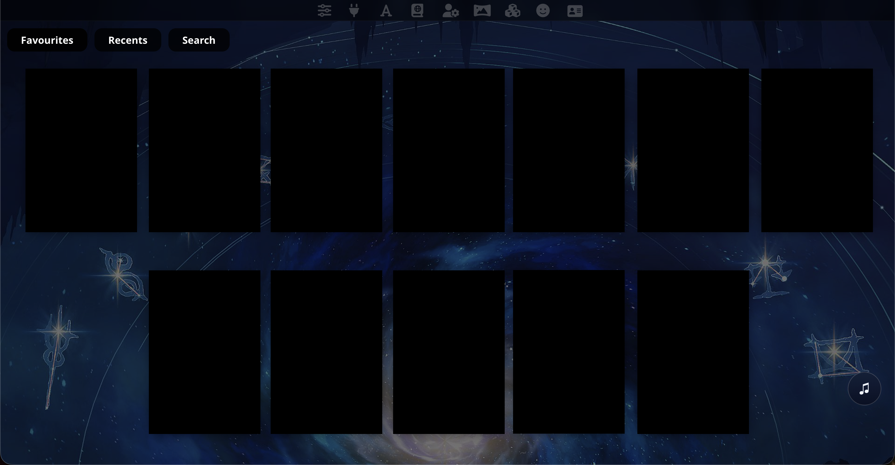

# Landing Page

A fork of Landing Page, with a loading screen, categories, and made beautiful for the modern era.

## Images

This will show character card images when installed, not just black boxes. Hidden for privacy.

## Installation

Use ST's  extension installer by going to Extensions (top bar) > Install Extension, and input this URL:  
https://github.com/jesseblueberry/SillyTavern-LandingPage-pretty

## Usage

Click on a character to open the last chat, and use the 'Favourites', 'Recents', and 'Search' to sort. 

## Recommended Settings

Recommended settings are:

- 'Wall' display style.
- 250 Card Height
- Number of characters to show as high as you want. Set it to a smaller number to limit the amount, or to a high number to show all.
- Ensure 'Always show favorites', 'Only show favorites' and 'Highlight favorites' are all disabled, or else unexpected issues may occur.
  
## Requirements

SillyTavern version >=1.11.1 staging (updated after 2023-12-17 19:00 UTC)
